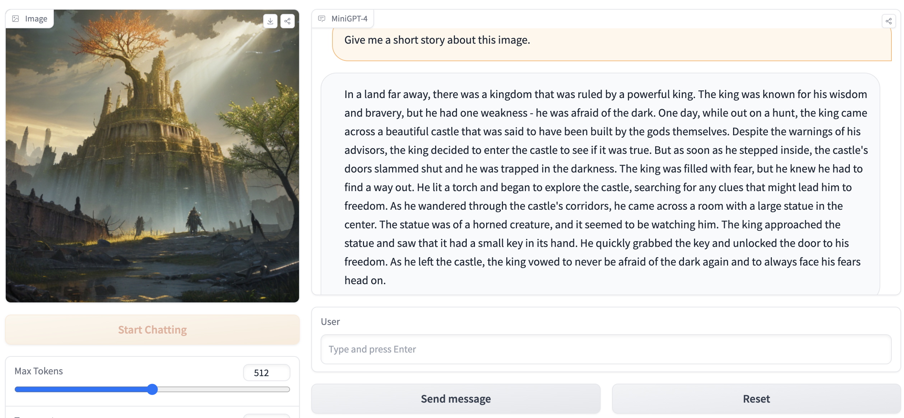
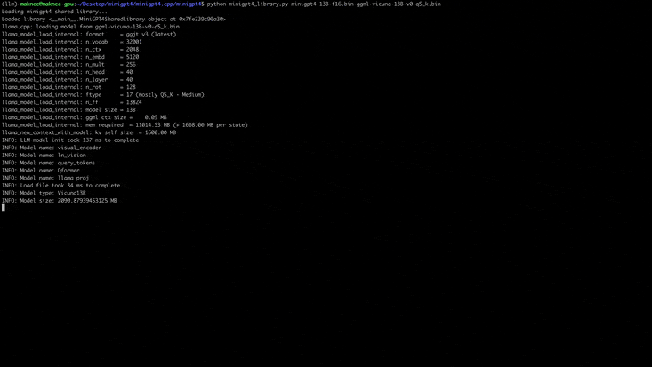

# minigpt4.cpp

<a href='https://huggingface.co/spaces/maknee/minigpt4.cpp'>
[](https://colab.research.google.com/github/Maknee/minigpt4.cpp/blob/master/minigpt4/colab_webui.ipynb)

Inference of [MiniGPT4](https://github.com/Vision-CAIR/MiniGPT-4) in pure C/C++.

## Description

The main goal of `minigpt4.cpp` is to run minigpt4 using 4-bit quantization with using the [ggml](https://github.com/ggerganov/ggml) library.

## Demo





## Usage

### 1. Clone repo

**Requirements**: [git](https://gitforwindows.org/)

```bash
git clone --recursive https://github.com/Maknee/minigpt4.cpp
cd minigpt4.cpp
```

### 2. Getting the library

#### Option 1: Download precompiled binary

##### Windows / Linux / MacOS

Go to [Releases](https://github.com/Maknee/minigpt4.cpp/releases) and extract `minigpt4` library file into the repository directory.

#### Option 2: Build library manually

##### Windows

**Requirements**: [CMake](https://cmake.org/download/), [Visual Studio](https://visualstudio.microsoft.com/) and [Git](https://gitforwindows.org/)

```commandline
cmake .
cmake --build . --config Release
```

`bin\Release\minigpt4.dll` should be generated

##### Linux

**Requirements**: CMake (Ubuntu: `sudo apt install cmake`)

```bash
cmake .
cmake --build . --config Release
```

`minigpt4.so` should be generated

##### MacOS

**Requirements**: CMake (MacOS: `brew install cmake`)

```sh
cmake .
cmake --build . --config Release
```

`minigpt4.dylib` should be generated

**Note:** If you build with opencv (allowing features such as loading and preprocessing image within the library itself), set `MINIGPT4_BUILD_WITH_OPENCV` to `ON` in `CMakeLists.txt` or build with `-DMINIGPT4_BUILD_WITH_OPENCV=ON` as a parameter to the cmake cli.

### 3. Obtaining the model

#### Option 1: Download pre-quantized MiniGPT4 model

Pre-quantized models are available on Hugging Face ~ [7B](https://huggingface.co/datasets/maknee/minigpt4-7b-ggml/tree/main) or [13B](https://huggingface.co/datasets/maknee/minigpt4-13b-ggml/tree/main).

Recommended for reliable results, but slow inference speed: [minigpt4-13B-f16.bin](https://huggingface.co/datasets/maknee/minigpt4-13b-ggml/blob/main/minigpt4-13B-f16.bin)

#### Option 2: Convert and quantize PyTorch model

**Requirements**: [Python 3.x](https://www.python.org/downloads/) and [PyTorch](https://pytorch.org/get-started/locally/).

Clone the [MiniGPT-4](https://github.com/Vision-CAIR/MiniGPT-4) repository and perform the setup

```sh
cd minigpt4
git clone https://github.com/Vision-CAIR/MiniGPT-4.git
cd MiniGPT-4
conda env create -f environment.yml
conda activate minigpt4
```

Download the pretrained checkpoint in the [MiniGPT-4](https://github.com/Vision-CAIR/MiniGPT-4) repository under `Checkpoint Aligned with Vicuna 7B` or `Checkpoint Aligned with Vicuna 13B` or download them from [Huggingface link for 7B](https://huggingface.co/datasets/maknee/minigpt4-7b-ggml/blob/main/pretrained_minigpt4_7b.pth) or [13B](https://huggingface.co/datasets/maknee/minigpt4-13b-ggml/blob/main/pretrained_minigpt4.pth)

Convert the model weights into ggml format

##### Windows

7B model
```commandline
cd minigpt4
python convert.py C:\pretrained_minigpt4_7b.pth --ftype=f16
```

13B model
```commandline
cd minigpt4
python convert.py C:\pretrained_minigpt4.pth --ftype=f16
```

##### Linux / MacOS

7B model
```sh
python convert.py ~/Downloads/pretrained_minigpt4_7b.pth --outtype f16
```

13B model
```sh
python convert.py ~/Downloads/pretrained_minigpt4.pth --outtype f16
```

`minigpt4-7B-f16.bin` or `minigpt4-13B-f16.bin` should be generated

#### 4. Obtaining the vicuna model

#### Option 1: Download pre-quantized vicuna-v0 model

Pre-quantized models are available on [Hugging Face](https://huggingface.co/datasets/maknee/ggml-vicuna-v0-quantized/tree/main)

Recommended for reliable results and decent inference speed: [ggml-vicuna-13B-v0-q5_k.bin](https://huggingface.co/datasets/maknee/ggml-vicuna-v0-quantized/blob/main/ggml-vicuna-13B-v0-q5_k.bin)

#### Option 2: Convert and quantize vicuna-v0 model

**Requirements**: [Python 3.x](https://www.python.org/downloads/) and [PyTorch](https://pytorch.org/get-started/locally/).

Follow the [guide from the MiniGPT4](https://github.com/Vision-CAIR/MiniGPT-4/blob/main/PrepareVicuna.md) to obtain the vicuna-v0 model.

Then, clone llama.cpp

```sh
git clone https://github.com/ggerganov/llama.cpp
cd llama.cpp
cmake .
cmake --build . --config Release
```

Convert the model to ggml

```sh
python convert.py <path-to-model>
```

Quantize the model

```sh
python quanitize <path-to-model> <output-model> Q4_1
```

#### 5. Running

Test if minigpt4 works by calling the following, replacing `minigpt4-13B-f16.bin` and `ggml-vicuna-13B-v0-q5_k.bin` with your respective models

```sh
cd minigpt4
python minigpt4_library.py minigpt4-13B-f16.bin ggml-vicuna-13B-v0-q5_k.bin
```

##### Webui

Install the requirements for the webui

```sh
pip install -r requirements.txt
```

Then, run the webui, replacing `minigpt4-13B-f16.bin` and `ggml-vicuna-13B-v0-q5_k.bin` with your respective models

```sh
python webui.py minigpt4-13B-f16.bin ggml-vicuna-13B-v0-q5_k.bin
```

The output should contain something like the following:

```sh
Running on local URL:  http://127.0.0.1:7860

To create a public link, set `share=True` in `launch()`.
```

Go to `http://127.0.0.1:7860` in your browser and you should be able to interact with the webui.
